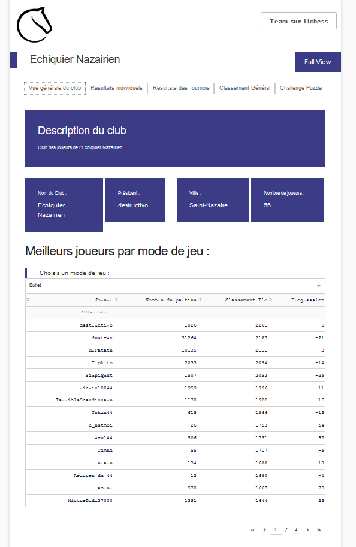

# App Data Visualisation Lichess

This repository presents the code of the app present at the [following link](https://lichess-app.herokuapp.com/)

The app is created with Dash and hosted on Heroku.

The goal was to produce a dashboard presenting some general informations about the `echiquier nazairien` team on [Lichess](https://www.lichess.org)

## Functioning of the app

The app produces general descritpion of the club in the `homepage`. 

Then you can go to other pages to get : 

- Information about one player in the `Resultats individuels` page;

- Results of tournaments taken one by one in the `Resultats des tournois` page;

- Result of all the tournament (overall ranking) in the `Classement général` page;

- The last page `Puzzle Challenge` is dedicated to puzzle, which are a way to train tactics on Lichess. This one is linked to an AWS S3 container which stocks the data everyday, as the Lichess API does not give over time evolution of number of puzzle played. 
